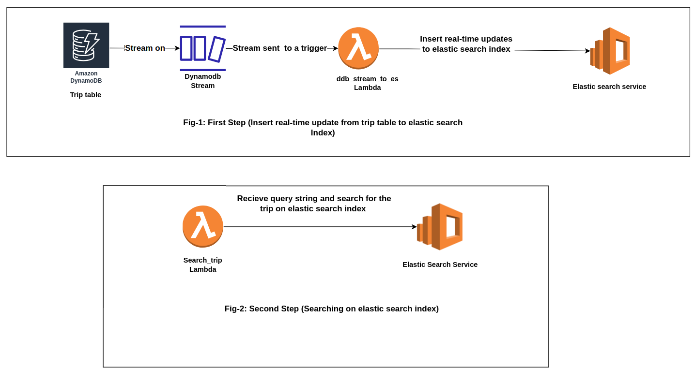

## The backstory
I was involved in a project focused on developing a fleet management system. One of the core functionalities of this system was the ability to search for available trips through a public API. Initially, we implemented this search feature using DynamoDB's query operation. However, we encountered a significant limitation with this approach. DynamoDB's query operation has a strict constraint: it can retrieve a maximum of 1 MB of data, and this limit is enforced before the filter expression is applied. As our data volume increased, this limitation became problematic, as our system couldn't locate trips that fell outside of that 1 MB data limit. To address this challenge, our solution was to implement AWS Serverless OpenSearch.

In this post I will demonstrate how I built a simple web based seach application using the [ Amazon OpenSearch Serverless ](https://docs.aws.amazon.com/opensearch-service/latest/developerguide/serverless-overview.html).

## The diagram 

