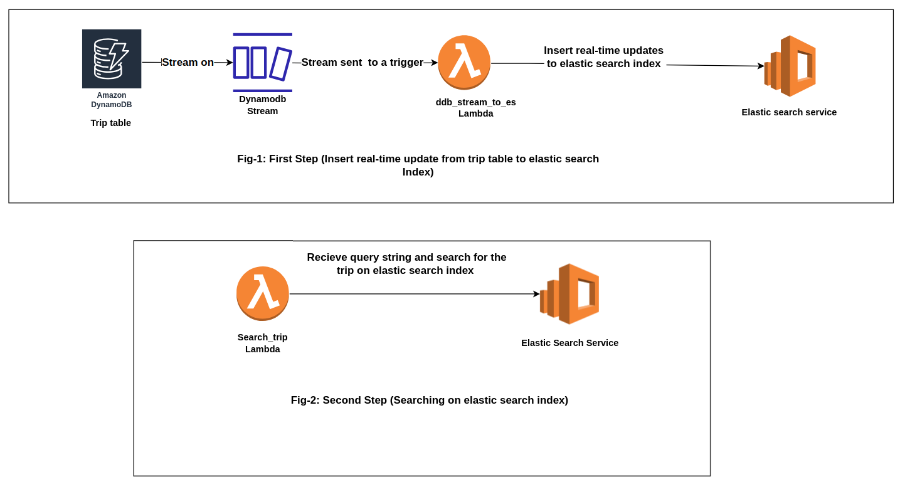

## The backstory
I was involved in a project focused on developing a fleet management system. One of the core functionalities of this system was the ability to search for available trips through a public API. Initially, we implemented this search feature using DynamoDB's query operation. However, we encountered a significant limitation with this approach. DynamoDB's query operation has a strict constraint: it can retrieve a maximum of 1 MB of data, and this limit is enforced before the filter expression is applied. As our data volume increased, this limitation became problematic, as our system couldn't locate trips that fell outside of that 1 MB data limit. To address this challenge, our solution was to implement AWS Serverless OpenSearch. We are using Dynamodb as database and AWS lambda for handling logics.

In this post I will demonstrate how I built a simple web based seach application using the [ Amazon OpenSearch Serverless ](https://docs.aws.amazon.com/opensearch-service/latest/developerguide/serverless-overview.html).

## A visual representation that illustrates the sequence of steps for better comprehension.

## Clarification :

A DynamoDB stream is an ordered flow of information about changes to items in a DynamoDB table. When you enable a stream on a table, DynamoDB captures information about every modification to data items in the table.
In practical terms, whenever a new trip is generated or any modifications are made to trip-related information, the DynamoDB stream associated with the __trip table__ sends this data to a designated AWS Lambda function, known as __ddb_stream_to_es.__ This Lambda function serves as a conduit, forwarding the data to the AWS Serverless OpenSearch service. In essence, this setup ensures that all trip-related data flows seamlessly into an ElasticSearch index through this orchestrated process.

To facilitate searching within the system, I've developed an additional AWS Lambda function named __search trip__. This Lambda function is responsible for executing queries on the ElasticSearch index, seeking the desired trip-related information.

Certainly, this is an overview of the system. Now, allow me to describe the implementation process, breaking it down into individual steps.

