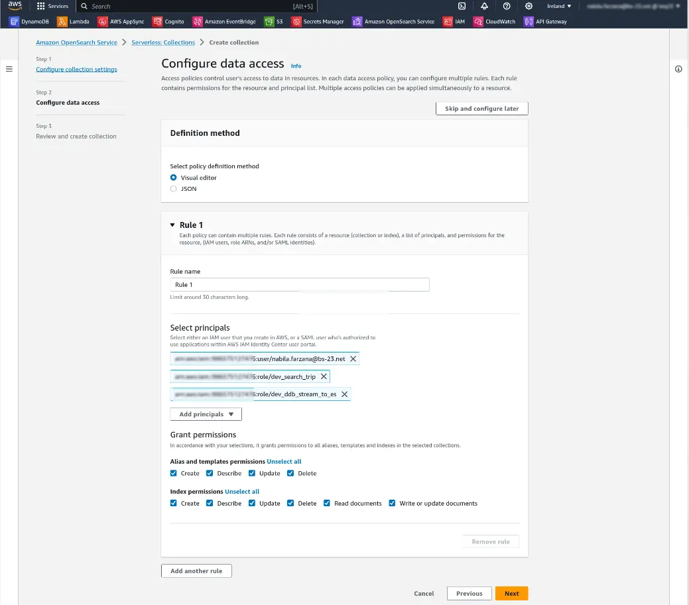

### The backstory:
I was involved in a project focused on developing a fleet management system. One of the core functionalities of this system was the ability to search for available trips through a public API. Initially, we implemented this search feature using DynamoDB's query operation. However, we encountered a significant limitation with this approach. DynamoDB's query operation has a strict constraint: it can retrieve a maximum of 1 MB of data, and this limit is enforced before the filter expression is applied. As our data volume increased, this limitation became problematic, as our system couldn't locate trips that fell outside of that 1 MB data limit. To address this challenge, our solution was to implement AWS Serverless OpenSearch. We are using Dynamodb as database and AWS lambda for handling logics.

In this post I will demonstrate how I built a simple web based seach application using the [ Amazon OpenSearch Serverless ](https://docs.aws.amazon.com/opensearch-service/latest/developerguide/serverless-overview.html).


### A visual representation that illustrates the sequence of steps for better comprehension:


### The implementation flow in a nutshell:

A DynamoDB stream is an ordered flow of information about changes to items in a DynamoDB table. When you enable a stream on a table, DynamoDB captures information about every modification to data items in the table.
In practical terms, whenever a new trip is generated or any modifications are made to trip-related information, the DynamoDB stream associated with the __trip table__ sends this data to a designated AWS Lambda function, known as __ddb_stream_to_es.__ This Lambda function serves as a chanel, forwarding the data to the AWS Serverless OpenSearch service. In essence, this setup ensures that all trip-related data flows seamlessly into an ElasticSearch index through this orchestrated process.

To facilitate searching within the system, I've developed an additional AWS Lambda function named __search trip__. This Lambda function is responsible for executing queries on the ElasticSearch index, seeking the desired trip-related information. And this lambda will be triggerd by an appsync API.

Certainly, this is an overview of the system. Now, allow me to describe the implementation process, breaking it down into individual steps.


### Step-1: Create a collection in Opensearch Serverless.

A [collection](https://docs.aws.amazon.com/opensearch-service/latest/developerguide/serverless-manage.html) in Amazon OpenSearch Serverless is a logical grouping of one or more indexes that represent an analytics workload.


Before you proceed with the creation of your collection, ensure that you include the following policies in your IAM role:
```json
{
    "Version": "2012-10-17",
    "Statement": [
        {
            "Action": [
                "aoss:CreateCollection",
                "aoss:ListCollections",
                "aoss:BatchGetCollection",
                "aoss:DeleteCollection",
                "aoss:CreateAccessPolicy",
                "aoss:ListAccessPolicies",
                "aoss:UpdateAccessPolicy",
                "aoss:CreateSecurityPolicy",
                "iam:ListUsers",
                "iam:ListRoles",
                "aoss:GetAccessPolicy",
                "aoss:CreateSecurityPolicy",
                "aoss:ListSecurityPolicies",
                "aoss:GetSecurityPolicy",
                "aoss:UpdateSecurityPolicy",
                "aoss:DeleteSecurityPolicy",
                "aoss:GetPoliciesStats",
                "aoss:GetAccountSettings",
                "aoss:UpdateAccountSettings",
                "iam:CreateServiceLinkedRole",
                "aoss:APIAccessAll",
                "aoss:DashboardsAccessAll"
            ],
            "Effect": "Allow",
            "Resource": "*"
        }
    ]
}
```
I am using [ AWS Management Console ](https://aws.amazon.com/console/) to create the collection


Next, we need to define the data access policy :
[Data access policies](https://docs.aws.amazon.com/opensearch-service/latest/developerguide/serverless-data-access.html) help you manage collections at scale by automatically assigning access permissions to collections and indexes that match a specific pattern.




And now we need to click submit button and a brand new collection is created with a dashboard url


Once the collection is created, then opensearch will provide an endpoint . You can retrive data by quering through this provided endpoint.

Now when you click on the dashboard url you will be redirected to the Opensearch Dashboard. [OpenSearch Dashboard](https://opensearch.org/docs/latest/dashboards/index/) is the user interface that lets you visualize your OpenSearch data and run and scale your OpenSearch clusters.OpenSearch Dashboards is a community-driven project forked from Kibana and is distributed under the Apache License 2.0, which is an open-source license.  

Log in to the dashboard using your AWS credential and create an index named trip-index using the following command in [Dev tools](https://opensearch.org/docs/latest/dashboards/dev-tools/index-dev/#:~:text=Use%20Dev%20Tools%20to%20set,the%20OpenSearch%20Dashboards%20home%20page.):

```
    PUT trip-index
    {
        "mappings": {
            "properties": {
            "id":    { "type" : "keyword" },
            "trip_start_date_time": { "type" : "date",  "format" : "strict_date_time_no_millis" }
            }
        }
    }
```
[Here](https://opensearch.org/docs/2.5/field-types/mappings/) you can find the mapping details.  

__A crucial point to emphasize is that if you require exact, strict matching for a field (without partial matching), you must define the field type as "keyword."__

Following the execution of this command, an index will be created, and the next step is to populate it with trip data, which will serve as the source for our trip searches.

### Step-2: Our next step involves transmitting data from the trip table, utilizing DynamoDB DataStream, to populate the OpenSearch trip-index.

We will now activate the DynamoDB table stream for the trip table and configure the DDB_stream_to_ES Lambda function as its trigger.


We must grant permissions for the DynamoDB stream to the DDB_stream_to_ES Lambda function and incorporate the following code to insert trip data into the OpenSearch index.

```python
import boto3
import requests
from requests_aws4auth import AWS4Auth
import json

INDEX = 'trip-index'
OPENSEARCH_ENDPOINT = 'Endpoint provided by opensearch'
REGION = 'eu-east-1' // your region
SERVICE = 'aoss'

def format_document(document, key):
    value = ''
    if document.get(key) is not None:
        if key == 'is_published':
            value= document[key]['BOOL']
        elif key == 'price':
            value= document[key]['N']
        else:
            value= document[key]['S']
    return value

def lambda_handler(event, context):
    try:
        credentials = boto3.Session().get_credentials()
        awsauth = AWS4Auth(credentials.access_key, credentials.secret_key, REGION, SERVICE, session_token=credentials.token)
        datatype = '_doc'
        url = OPENSEARCH_ENDPOINT + '/' + INDEX + '/' + datatype + '/'
        headers = { "Content-Type": "application/json" }
        count = 0
        for record in event['Records']:
            # Get the primary key for use as the Elasticsearch ID
            id = record['dynamodb']['Keys']['id']['S']

            if record['eventName'] == 'REMOVE':
                r = requests.delete(url + id, auth=awsauth)
                print("delet item: ", r.json())
            else:
                document = record['dynamodb']['NewImage']
                document_to_insert = {
                    'id': format_document(document, 'id'),
                    'trip_name': format_document(document, 'trip_name'),
                    'start_location': format_document(document, 'start_location'),
                    'trip_start_date_time': format_document(document, 'trip_start_date_time'),
                    'end_location': format_document(document, 'start_location'),
                    'price': format_document(document, 'price'),
                    'is_published': format_document(document, 'is_published')
                }
                
                r = requests.put(url + id, auth=awsauth, json=document_to_insert, headers=headers)
            count += 1
        return str(count) + ' records processed.'
    except Exception as err:
        print("Dynamodb stream into opensearch Exception = ",err)

```

### Step-3: Create a Lambda function for conducting trip searches within OpenSearch.

The final task involves crafting an additional Lambda function, named "search_trip," to execute queries on the OpenSearch trip-index to find the desired trips. __This lambda will be triggered by an [appsync query](https://aws.amazon.com/pm/appsync/?trk=a0465925-8003-4d68-bc59-c7cd4211829e&sc_channel=ps&ef_id=CjwKCAjw38SoBhB6EiwA8EQVLogGFZk7gkykFn17c-c_35DX0SnkB0ViheooM-z-vm6B3-hZU-GBbxoCKzAQAvD_BwE:G:s&s_kwcid=AL!4422!3!647258140296!p!!g!!appsync!19621397201!145160425389).__  

__In search_trip lambda, we are utilizing [Query DSL](https://opensearch.org/docs/2.5/query-dsl/) to perform queries on the "trip_index.".__

```python
import boto3
from boto3.dynamodb.conditions import Key, Attr
import requests
from requests_aws4auth import AWS4Auth
import json

INDEX = 'trip_index'
OPENSEARCH_ENDPOINT = 'Endpoint provided by opensearch'
REGION = 'eu-east-1'
SERVICE = 'aoss'

def lambda_handler(event, context):
    try:
        credentials = boto3.Session().get_credentials()
        awsauth = AWS4Auth(credentials.access_key, credentials.secret_key, REGION, SERVICE, session_token=credentials.token)
        search_url = OPENSEARCH_ENDPOINT + '/' + INDEX + '/_search'
        headers = { "Content-Type": "application/json" }
        
        search_query= event['arguments']['input']
        query_string= search_query.get('query_string')
        from_date= search_query.get('from_date')
        to_date= search_query.get('to_date')
        page= search_query.get('page', 1)
        limit= search_query.get('limit', 25)
       
        start = (page - 1) * limit
        trip_to_retrieve = []
        
        if limit > 100:
            return 'Limit Can not be more than 100 !'
        
        query = {
                "from": start,
                "size": limit,
                "query": {
                    "bool":{
                       "must":[
                            {
                                "match":{
                                    "is_published":true
                                }
                            },
                            {
                                "multi_match":{
                                    "query":query_string,
                                    "fields":[
                                    "id",
                                    "trip_name",
                                    "strat_location",
                                    "end_location",
                                    "price"
                                    ]
                                }
                            },
                            {
                                "range": {
                                    "trip_start_date_time": {
                                        "gte": from_date,
                                        "lte": to_date
                                    }
                                }
                            }
                       ]
                    }
                },
                "sort": [
                    {
                        "trip_start_date_time": {
                            "order": "desc"
                        }
                    }
                 ]
                
            }
        
        # Make the signed HTTP request
        r = requests.get(search_url, auth=awsauth, headers=headers, data=json.dumps(query))
        search_result = r.json()

        total= search_result.get('hits').get('total')['value']
        if total > 0:
            items = search_result.get('hits').get('hits')
            search_response = {
                'total': search_result.get('hits').get('total')['value'],
                'items': items
            }
            return search_response

    except Exception as err:
        print("Search Trip Exception = ",err)
```

With Query DSL, we have the capability to incorporate pagination through the "from" and "size" properties, arrange data in both ascending and descending orders using the "sort" property, and perform queries within a specified date range using the "range" property.

__And last but not the least,  it's essential to remember that you should include the "ddb_stream_to_es" and "search_trip" lambda roles, as well as your IAM user role, in the OpenSearch data access policy to enable access and perform CRUD (Create, Read, Update, Delete) operations on indexes within the specified collection.__

### *Thank you for your patience!! I hope you found this article useful. Happy reading!*