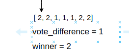
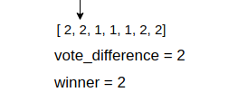
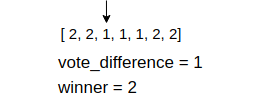
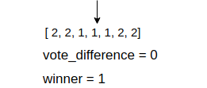
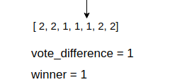
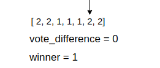
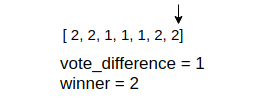

### Problem Statement:
Given an array nums of size n, return the majority element.
The majority element is the element that appears more than ⌊n / 2⌋ times. You may assume that the majority element always exists in the array.

#### Example:
__Input__: nums = [3,2,3]  
__Output__: 3  
__Follow-up__: Could you solve the problem in linear time and in O(1) space?

### How to solve it:
To solve this problem, the easiest way could be:  
First sorting the array and as the definition of majority element is: the element which appears more than n/2
times in the array, so it should appear in the middle of the array. So, The next step is to find out the middle elemnt of that sorted array. That's it! 
But there is a problem,  The time complexity should be lenear, but if we use sorting algorithm then the time complexity will be O(nlogn)

So, let's find out an optimal solution!

### The optimal solution:
We can solve this problem in O(n) time complexity using voting algorithm. Let's understand how this works!

let's assume an array : [ 2, 2, 1, 1, 1, 2, 2 ]

this is an array contains the information how many vote has been casted for candidate '1' and '2'.  
We will maintain a variable to store the winner and another variable will hold the number of additional votes the winner receives compared to others, let's say, it is __vote_difference__.  

first we will set 0 for both variables:

winner = 0
vote_difference = 0

Now starting from the first element of the array, which is 2, till now I don't know about the rest of the array, So I got one vote for '2', and set the winner to 2. As till now only one vote casted for '2', hence  the vote_difference is 1


then we are moving to the 2nd element of the array, which is 2 again. So we are not changing the winner but now vote_difference is increasing by 1


now we are moving to the 3rd element, which is 1. Now we see a vote is casted for '1' so we are decreasing vote_difference by 1, but still winner is 2, because 2 got an extra vote than 1


next we are moving to the 4th element, which is 1. Now another vote for 1, so we are decreasing the vote_difference by 1. Now we see there is no vote difference between '1' and '2'. They got same amount of vote. 


So now there is no vote difference and next element is 1. we will set '1' as winner and the vote_difference is 1


next element is 2, now we see opponent '2' got one vote, so we are decreasing vote_difference by one and again vote difference is 0 and winner remains same


And finally the last element which is 2. So we got a vote for '2', So setting the winner as 2 and increase the vote_difference by one. So we go our winner which is '2' and s/he won by 1 vote!


__Now let's come up with the code__

```cpp
int majorityElement(vector<int>& nums){
    int winner = 0;
    int vote_difference = 0;
    for(auto num: nums){
        if(vote_difference == 0){
            winner = num
        }
        if(num == wimmer)vote_difference++;
        else vote_difference--;
    }
    return winner;
}
```
#### Explanantion: 
We will loop through the given array and each time we will check if the vote_difference is 0 or not. If it is 0, then set the current element as winner. And if the vote diffrence is not 0, we need to check if the current element is equal to the winner or not. If equal, we will increase the vote difference, otherwise decrease the vote_difference.
And when array travarsal is finished, then we will return the winner.

### Time and space complexity:
The time complexity is __O(n)__ and space complexity is __O(1)__